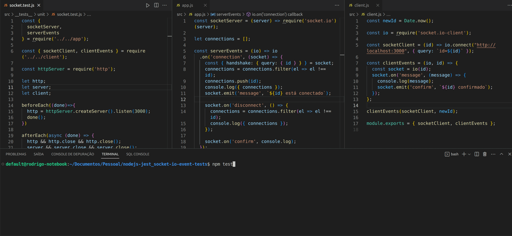

# socket-io-event-tests



## Descrição / Description

Teste de cobertura utilizando `socket.io`.

Coverage test using `socket.io`.

> Baseado no artigo / Based on the article: ['How to test Socket.io with Jest on backend (Node.js)?'](https://medium.com/@tozwierz/testing-socket-io-with-jest-on-backend-node-js-f71f7ec7010f)


## Como rodar / How to run

> ⚠️ Necessita do [NodeJS](https://nodejs.org/pt-br/). O projeto foi testado utilizando a versão `16.17.1`.

> ⚠️ Requires [NodeJS](https://nodejs.org/en/). The project was tested using version `16.17.1`.

```bash
npm i # Install the packages / Instale os pacotes
```

```bash
npm test # Run the `test` script / Rode o script `test`
```

## Rodar com o Docker / Run with Docker

> ⚠️ Necessita do [Docker](https://docs.docker.com/engine/install/) instalado no host para funcionar.

> ⚠️ Requires [Docker](https://docs.docker.com/engine/install/) installed on the host to work.

```bash
docker run -it --rm -v $(pwd):/app node:16.17.1 npm --prefix=/app test
```